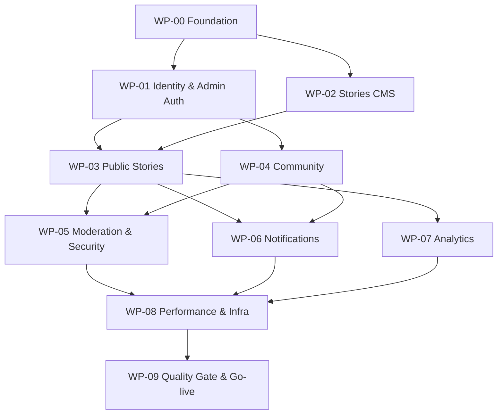

# P1-WORK — Stage Map, Traceability & Atomic Issue Entry

> **Phase:** 1 · **Version:** 2.2 · **Role:** Lớp thực thi; không phải source of truth nghiệp vụ.  
> **Depends on:** [Master Index](../Zenly_Ecosystem_Phase_1_Plan.md) và các module được ghi trong từng work package.  
> Nếu issue khác module canonical, dừng code và báo `SPEC_CONFLICT`.

[← P1-REF](15_TECHNICAL_REFERENCES.md) · [Master Index](../Zenly_Ecosystem_Phase_1_Plan.md)

> **Execution entry:** [P1-ISSUES — Atomic Issue Index](Issues/00_ISSUE_INDEX.md).  
> Các WP bên dưới chỉ là stage map. Không giao nguyên WP cho AI triển khai; mỗi lần phải chọn đúng một file atomic issue.

## 1. Quy tắc dùng work package

- Chỉ làm một work package tại một thời điểm trừ khi dependency graph cho phép song song rõ ràng.
- Trước khi code: đọc Master + `Read first` + toàn bộ dependency của các file đó.
- Trong khi code: cập nhật test cùng thay đổi; không để test thành task cuối dự án.
- Trước khi đóng: điền bằng chứng migration/API/UI/test/acceptance; không dùng câu “đã code xong” làm bằng chứng.
- Issue có thể chia nhỏ task kỹ thuật, nhưng không được định nghĩa lại role, flag, state, schema hoặc API.

## 2. Dependency graph



## 3. Stage packages — không phải đơn vị code

### WP-00 — Repository, architecture và database skeleton

- **Read first:** `P1-SCOPE`, `P1-ARCH`, `P1-DATA`, `P1-QA`.
- **Delivers:** Nuxt/Nitro modular monolith, PostgreSQL/Prisma, Caddy/Docker local, env validation, module boundary, migration/seed skeleton và CI static/unit gate.
- **Blocked by:** Không.
- **Done when:** build sạch; migration zero chạy; TypeScript strict/lint/unit gate xanh; không Redis/microservice/media user.

### WP-01 — User auth, Admin 2FA, RBAC và System settings

- **Read first:** `P1-ADMIN`, `P1-FLOW`, `P1-DATA`, `P1-API`, `P1-SEC`, `P1-QA`.
- **Delivers:** user auth/session/verify/reset; admin challenge/TOTP/recovery; SUPER_ADMIN/ADMIN/USER; System menu; community và notification setting optimistic concurrency/audit.
- **Blocked by:** WP-00.
- **Done when:** auth/RBAC/2FA/last-SUPER_ADMIN/session revoke/403/feature-flag tests đạt gate.

### WP-02 — Stories, chapters TXT và CMS jobs

- **Read first:** `P1-PUBLIC`, `P1-ADMIN`, `P1-FLOW`, `P1-DATA`, `P1-API`, `P1-SEC`, `P1-QA`.
- **Delivers:** CRUD story/chapter, TXT validation/private storage, YouTube URL, import preview/chunk job/progress, publish activity idempotent.
- **Blocked by:** WP-00, WP-01 admin auth.
- **Done when:** import/retry/resume/cancel/atomic file/visibility tests và CMS acceptance đạt.

### WP-03 — Public stories, reader, SEO shell và visual system

- **Read first:** `P1-PUBLIC`, `P1-FLOW`, `P1-API`, `P1-PERF`, `P1-ACCEPT`.
- **Delivers:** home/feed shell, story list/detail, chapter reader, read/listen CTA, responsive tiên hiệp UI, SSR metadata và public states.
- **Blocked by:** WP-01, WP-02.
- **Done when:** mobile/desktop/accessibility/performance/visibility/YouTube fallback E2E đạt.

### WP-04 — Community feed, guest like/comment và user posting bị khóa

- **Read first:** `P1-SCOPE`, `P1-PUBLIC`, `P1-ADMIN`, `P1-FLOW`, `P1-DATA`, `P1-API`, `P1-QA`.
- **Delivers:** cursor/virtualization, guest/user like, guest comment/reply + ownership 15 phút, moderation states, counters, profile/notification shell, posting feature flag mặc định off.
- **Blocked by:** WP-01, WP-03 shell.
- **Done when:** concurrent counters, merge guest-like, ownership, API flag enforcement và 1.000-card performance tests đạt.

### WP-05 — Moderation, abuse guard, privacy và copyright

- **Read first:** `P1-SEC`, `P1-ADMIN`, `P1-FLOW`, `P1-DATA`, `P1-API`, `P1-QA`, `P1-REF`.
- **Delivers:** rule/risk engine, moderation adapter, golden dataset, pending fail-safe, CAPTCHA/rate limit/block, privacy/consent, copyright workflow và SUPER_ADMIN-only abuse UI.
- **Blocked by:** WP-02, WP-04.
- **Done when:** AI golden/adversarial/provider-failure gate, security scan và role isolation đạt.

### WP-06 — Story request, subscriptions, Web Push/email và cost guard

- **Read first:** `P1-PUBLIC`, `P1-ADMIN`, `P1-FLOW`, `P1-DATA`, `P1-API`, `P1-INFRA`, `P1-QA`.
- **Delivers:** request guest/user, verified email, NEW_STORIES/STORY_CHAPTERS, Web Push, publication event/fan-out/outbox, quota priority/defer, auto-send toggle, no Zalo paid integration.
- **Blocked by:** WP-01, WP-02, WP-03.
- **Done when:** closed-site push/email, batch chapters, no duplicate, 404/410 revoke, quota no-charge và toggle isolation tests đạt.

### WP-07 — Tracking, analytics, public metrics và dashboard

- **Read first:** `P1-FLOW`, `P1-DATA`, `P1-API`, `P1-PERF`, `P1-SEC`, `P1-QA`.
- **Delivers:** tracking redirect, visitor/session/events, active/presence, counters, aggregation, dashboard filter/chart/table và bot exclusion.
- **Blocked by:** WP-03.
- **Done when:** dedupe/attribution/presence/bot/query-plan/load tests và dashboard acceptance đạt.

### WP-08 — Cache, PWA, VPS 2 GB, deploy, backup và observability

- **Read first:** `P1-PERF`, `P1-INFRA`, `P1-SEC`, `P1-QA`, `P1-ACCEPT`.
- **Delivers:** cache/invalidation, PWA safe cache, production Compose, health/readiness, logs, resource guard, free off-VPS backup, restore/rollback runbook.
- **Blocked by:** WP-03, WP-05, WP-06, WP-07.
- **Done when:** cold/warm load, VPS 2 GB budget, backup/restore, provider outage và rollback drill đạt.

### WP-09 — Full Quality Gate, staging acceptance và production go-live

- **Read first:** Toàn bộ module, bắt buộc `P1-ROADMAP`, `P1-QA`, `P1-ACCEPT`.
- **Delivers:** CI/CD gate cuối, coverage/mutation, PostgreSQL migration-from-previous, E2E desktop/mobile, security/performance/recovery suite, staging soak và release evidence.
- **Blocked by:** WP-00 đến WP-08.
- **Done when:** mọi acceptance checkbox có bằng chứng; không P0/P1; không flaky/skip không lý do; artifact production có rollback và Phase 1 launch flags đúng seed.

## 4. Traceability map

| Capability | Canonical requirements | Data | API/UI | Mandatory tests | Acceptance |
|---|---|---|---|---|---|
| Auth + Admin 2FA + RBAC | `P1-ADMIN`, `P1-SEC` | `P1-DATA` | `P1-API` | `P1-QA` auth/RBAC/TOTP | `P1-ACCEPT` Admin/Kỹ thuật |
| Stories + TXT + YouTube | `P1-PUBLIC`, `P1-FLOW` | `P1-DATA` | `P1-API`, `P1-ADMIN` | parser/import/visibility/E2E | Public/Admin |
| Community guest interaction | `P1-SCOPE`, `P1-PUBLIC`, `P1-FLOW` | `P1-DATA` | `P1-API` | ownership/concurrency/flag/E2E | Public/Kỹ thuật |
| Moderation/AI | `P1-SEC` | moderation decisions trong `P1-DATA` | moderation/Admin trong `P1-API` | golden/adversarial/fail-safe/mutation | Public/Kỹ thuật |
| Story updates outside website | `P1-PUBLIC`, `P1-FLOW` | subscriptions/events/outbox trong `P1-DATA` | public/system endpoints trong `P1-API` | fan-out/quota/toggle/provider failure | Public/Admin/Kỹ thuật |
| Analytics/tracking | `P1-FLOW` | analytics/counters trong `P1-DATA` | metrics/dashboard trong `P1-API` | dedupe/bot/presence/query/load | Public/Admin |
| Security/privacy/copyright | `P1-SEC`, `P1-REF` | audit/contact/block/ticket trong `P1-DATA` | Admin/public endpoints trong `P1-API` | security/privacy/role isolation | Admin/Kỹ thuật |
| VPS/deploy/backup | `P1-INFRA`, `P1-PERF` | migration/volume rules `P1-DATA` | health/System UI `P1-ADMIN` | load/recovery/rollback | Kỹ thuật |

## 5. Issue completion evidence template

```text
Issue / Work package:
Requirement IDs:
Dependencies read:
Files/modules changed:
Migration/schema impact:
API/UI impact:
Unit/component evidence:
Integration/contract evidence:
E2E/security/performance evidence:
Acceptance items satisfied:
Rollback notes:
Known limitations (không được có P0/P1):
```

## 6. Atomic execution layer

- Danh sách đầy đủ: [Issues/00_ISSUE_INDEX.md](Issues/00_ISSUE_INDEX.md).
- Phase 1 hiện được tách thành 74 atomic issue từ `P1-I001` đến `P1-I108` (ID có khoảng trống để thể hiện stage).
- Mỗi issue có dependency, canonical modules phải đọc, change surface, implementation boundary, test cùng thay đổi, acceptance gate và evidence riêng.
- AI không được đọc/cố triển khai toàn bộ 74 issue trong một lần. Orchestrator chỉ cấp đúng issue hiện tại và dependency/canonical modules của nó.
