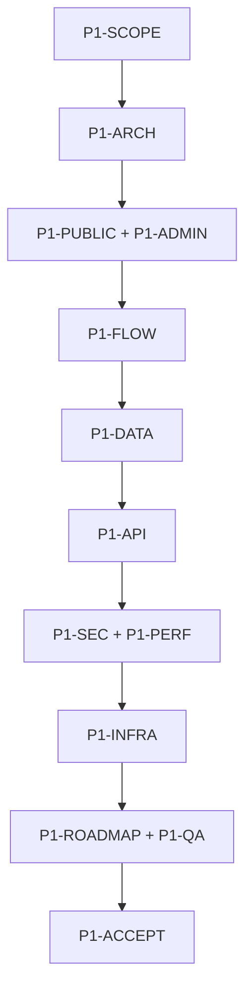

# ZENLY ECOSYSTEM — PHASE 1 MASTER INDEX

**Tên sản phẩm:** Zenly Stories  
**Thương hiệu:** Zenly Ecosystem  
**Phiên bản đặc tả:** 2.2  
**Ngày chốt:** 04/08/2026  
**Trạng thái:** Phase 1 đã khóa; 16 module canonical + atomic issue layer để AI triển khai từng việc nhỏ

> Đây là file phải đọc đầu tiên. Chi tiết Phase 1 v2.2 đã được chuyển nguyên vẹn vào các module trong thư mục `Phase 1`. Mỗi requirement chỉ có một module canonical; work package/issue chỉ tham chiếu, không được định nghĩa lại.

## 1. Global invariants — không module/issue nào được phép sửa ngầm

1. Một Nuxt/Nitro modular monolith + PostgreSQL + Caddy; launch chạy VPS 2 GB, không Redis/microservice/queue server riêng.
2. Guest/user được xem, chia sẻ, like, comment/reply và yêu cầu truyện lúc launch; user posting/report mặc định tắt bằng runtime flag.
3. Guest comment ownership dựa visitor token/hash, chỉ sửa/soft-delete trong 15 phút; không yêu cầu login để bình luận.
4. SUPER_ADMIN có toàn bộ nghiệp vụ + System/hạ tầng; ADMIN chỉ nghiệp vụ; USER chỉ public/default. UI ẩn và API đều enforce 403.
5. Chỉ SUPER_ADMIN bật/tắt community feature và auto-send trong CMS; không sửa code/deploy. Auto-send off không chặn auth/security/story-request notification và bật lại không xả backlog.
6. Phase 1 user post text-only; không media user. Phase 2 VIP mới tối đa 4 ảnh WebP 1080×1080 + thumbnail 540×540.
7. User nhận tin ngoài website bằng Web Push opt-in hoặc verified email free tier; không Zalo API trả phí, không auto-overage/auto-renew.
8. Source code Git; backup PostgreSQL + TXT/cover ra ngoài VPS bằng phương án 0đ; snapshot trả phí chưa bắt buộc.
9. Admin/SUPER_ADMIN bắt buộc password + TOTP; user session không bao giờ gọi được admin API.
10. Automated Moderation Phase 1 chỉ kiểm tra text; provider lỗi fail-safe `PENDING`, không auto-public và không kết luận bản quyền.
11. Không test thì chưa xong: CI Quality Gate, PostgreSQL thật, AI golden dataset, E2E/security/performance/recovery và regression là bắt buộc.
12. Không marketplace, 3D commerce, payment/VIP, mobile app, chat realtime hoặc AI sinh nội dung trong Phase 1.

## 2. Module registry

| ID | Canonical file | Owns | Depends on |
|---|---|---|---|
| `P1-SCOPE` | [01_PRODUCT_SCOPE_RELEASE.md](Phase%201/01_PRODUCT_SCOPE_RELEASE.md) | Mục tiêu, phạm vi launch, quyền public ban đầu, global decisions và ranh giới không được lén mở rộng. | — |
| `P1-ARCH` | [02_ARCHITECTURE_CODEBASE.md](Phase%201/02_ARCHITECTURE_CODEBASE.md) | Kiến trúc modular monolith, công nghệ, module backend, repository và nguyên tắc small-VPS-first. | P1-SCOPE |
| `P1-PUBLIC` | [03_PUBLIC_UX_AND_PRODUCT.md](Phase%201/03_PUBLIC_UX_AND_PRODUCT.md) | Toàn bộ route, trạng thái, feed, đọc/nghe, comment, account, request, notification opt-in và art direction public. | P1-SCOPE, P1-ARCH |
| `P1-ADMIN` | [04_ADMIN_RBAC_AND_SYSTEM_UI.md](Phase%201/04_ADMIN_RBAC_AND_SYSTEM_UI.md) | CMS, 2FA, ma trận SUPER_ADMIN/ADMIN/USER, System menu, feature flags, auto-notification toggle và admin UX. | P1-SCOPE, P1-ARCH |
| `P1-FLOW` | [05_BUSINESS_FLOWS.md](Phase%201/05_BUSINESS_FLOWS.md) | Luồng nghiệp vụ end-to-end, state transition, publish, comment, analytics, abuse guard, contact và notification. | P1-SCOPE, P1-PUBLIC, P1-ADMIN |
| `P1-DATA` | [06_DATABASE_SCHEMA.md](Phase%201/06_DATABASE_SCHEMA.md) | Schema PostgreSQL, constraint, index, counter, session, feed, notification, analytics, audit và runtime settings. | P1-ARCH, P1-FLOW |
| `P1-API` | [07_API_CONTRACTS.md](Phase%201/07_API_CONTRACTS.md) | Public/user/admin/system API, DTO, cursor, idempotency, cache header và authorization contract. | P1-FLOW, P1-DATA, P1-ADMIN |
| `P1-SEC` | [08_SECURITY_MODERATION_AND_PRIVACY.md](Phase%201/08_SECURITY_MODERATION_AND_PRIVACY.md) | Security controls, spam/crawl defense, moderation policy, privacy, consent, encryption và data exposure rules. | P1-ADMIN, P1-FLOW, P1-DATA, P1-API |
| `P1-PERF` | [09_SEO_PERFORMANCE_CACHE_AND_PWA.md](Phase%201/09_SEO_PERFORMANCE_CACHE_AND_PWA.md) | SEO SSR, cache matrix/invalidation, performance budgets, mobile/PWA và crawler behavior. | P1-ARCH, P1-PUBLIC, P1-DATA, P1-API, P1-SEC |
| `P1-INFRA` | [10_INFRA_DEPLOY_COST_AND_BACKUP.md](Phase%201/10_INFRA_DEPLOY_COST_AND_BACKUP.md) | VPS 2 GB launch, Docker services, resource budget, backup 0đ, monitoring, deploy và chi phí. | P1-ARCH, P1-DATA, P1-SEC, P1-PERF |
| `P1-ROADMAP` | [11_IMPLEMENTATION_ROADMAP.md](Phase%201/11_IMPLEMENTATION_ROADMAP.md) | Thứ tự code, thời lượng, dependency giữa chặng và Definition of Done ở cấp chặng. | P1-SCOPE, P1-ARCH, P1-PUBLIC, P1-ADMIN, P1-FLOW, P1-DATA, P1-API, P1-SEC, P1-PERF, P1-INFRA |
| `P1-QA` | [12_TESTING_AND_QUALITY_GATES.md](Phase%201/12_TESTING_AND_QUALITY_GATES.md) | Unit/integration/contract/E2E/security/performance/recovery test, AI golden dataset, coverage, CI/CD gate và failure injection. | P1-SCOPE, P1-ARCH, P1-PUBLIC, P1-ADMIN, P1-FLOW, P1-DATA, P1-API, P1-SEC, P1-PERF, P1-INFRA |
| `P1-ACCEPT` | [13_ACCEPTANCE_AND_RELEASE_CHECKLIST.md](Phase%201/13_ACCEPTANCE_AND_RELEASE_CHECKLIST.md) | Tiêu chí nghiệm thu public/admin/kỹ thuật và release gate cuối cùng. | P1-ROADMAP, P1-QA |
| `P1-FUTURE` | [14_FUTURE_EVOLUTION.md](Phase%201/14_FUTURE_EVOLUTION.md) | Ranh giới Phase 2+, VIP image, 3D và điều kiện tách service; không được kéo ngược vào Phase 1. | P1-SCOPE, P1-ARCH, P1-DATA |
| `P1-REF` | [15_TECHNICAL_REFERENCES.md](Phase%201/15_TECHNICAL_REFERENCES.md) | Nguồn kỹ thuật/pháp lý tham chiếu cho các quyết định, không tự ghi đè requirement. | — |
| `P1-WORK` | [16_TRACEABILITY_AND_AI_WORK_PACKAGES.md](Phase%201/16_TRACEABILITY_AND_AI_WORK_PACKAGES.md) | Dependency graph cấp stage, traceability và quy tắc thực thi; không sở hữu requirement nghiệp vụ. | Tất cả module liên quan |
| `P1-ISSUES` | [Issues/00_ISSUE_INDEX.md](Phase%201/Issues/00_ISSUE_INDEX.md) | Danh mục atomic issue: mỗi file là một thay đổi có thể code, test và nghiệm thu trong một lượt AI. | P1-WORK + module ghi trong từng issue |

## 3. AI reading protocol

1. Luôn đọc file Master này trước.
2. Mở `P1-ISSUES`, chọn đúng một issue có dependency đã DONE; không yêu cầu AI đọc toàn bộ 74 issue.
3. Đọc toàn bộ canonical module được ghi trong issue và dependency cần thiết của chúng.
4. Trước code, liệt kê Requirement ID sẽ thực hiện và file/module sẽ sửa.
5. Viết test cùng logic; không dồn test cuối phase.
6. Nếu issue, code hiện tại và canonical module mâu thuẫn: dừng với `SPEC_CONFLICT`; không tự chọn một phương án.
7. Chỉ đóng issue khi điền đủ evidence template và acceptance tương ứng.

## 4. Dependency overview

## 5. Change control

- Thay requirement ở đúng canonical module trước; cập nhật Master chỉ khi global invariant/dependency/version thay đổi.
- Chạy impact review qua `P1-WORK` traceability: schema, API, UI, security, test và acceptance.
- Không tạo file `final`, `copy`, `(2)` hoặc requirement trùng. Version nằm trong Master/module metadata.
- Issue không phải source of truth. Khi issue đóng, requirement vẫn sống trong canonical module.

## 6. Bắt đầu triển khai

Mở [P1-ISSUES — Atomic Issue Index](Phase%201/Issues/00_ISSUE_INDEX.md), bắt đầu từ `P1-I001`. Mỗi lần chỉ giao cho AI đúng **Master + Issue Index + một issue + canonical modules ghi trong issue**. Các WP trong `P1-WORK` chỉ còn dùng để nhìn stage/dependency tổng quan, không được giao nguyên một WP lớn cho AI code.
